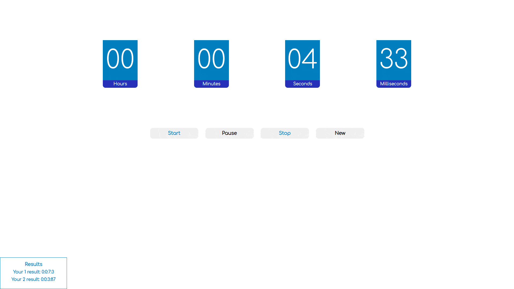

# Мини-приложение Timer
В приложении есть кнопки *start*, *pause*, *stop* и *new*. При нажатии на stop таймер останавливается и обнуляется, а при нажатии на new создается запись в таблицу результатов (в левом нижнем углу) и начинается новый отсчет времени. 

